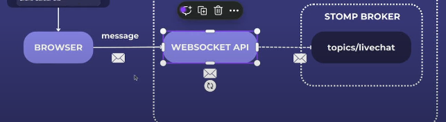
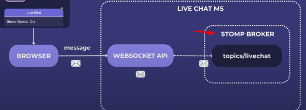
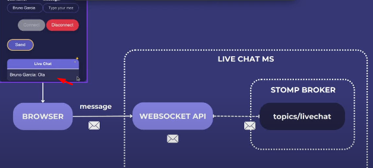
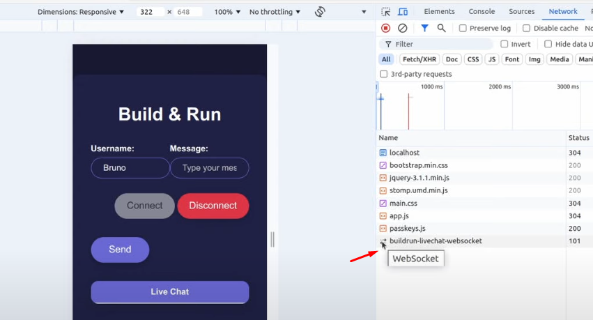
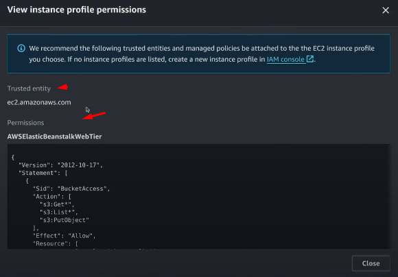

# About

A live chat project using Java, Spring Boot, Websockets, STOMP and AWS.

# What we'll do

- Learn the project structure
- Learn the difference between HTTP vs STOMP
- Understand more about STOMP protocol
- Build a project with Spring Boot, WebSocket and STOMP
- Deploy the project on AWS with ElasticBeanstalk

# Backend

- Spring Boot
- WebSocket
- STOMP

# Frontend

[Use this frontend](https://github.com/buildrun-tech/buildrun-livechat-spring-boot-websocket-stomp)

- HTML, CSS and JavaScript
- JQuery
- StompJS

# Project architecture and flow

## How does the HTTP protocol works?


- Unidirectional communication (request and response)
- Short connections
- Ideal to Rest APIs, file downloader, etc

So, HTTP is not the ideal type to real time communication (like a livechat).

## How does the STOMP protocol works?

Uses websocket as a transport layer


- Bidirectional communication (connect (started by the client), send, receive, disconnect).
  - The server can also send communication to the Client
- Persistent connection
- Ideal to real time communication

### Stomp


STOMP equals **Simple Text Oriented Messaging Protocol**.

He's kinda like HTTP but works in a different way. As we say in the topic above, when the websocket communicate with
STOMP we have a **bidirectional communication**.

The first connection is made, and inside this channel we have this **STOMP FRAME**.

#### Stomp Frame

Stomp frame can be sent **from the client to the server**, and vice versa. He has three fields:

1. Command
2. Headers
3. Body

#### Command

Basically, it would be the HTTP methods.

It can be:

- Connect
- Subscribe;
- Send
- Message
- Disconnect
- Others...

#### Headers

Kinda similar to HTTP as well (Key:Value), we have header1:value2 or header2:value2.

#### Body

When we have a send operation, for example we'll have the information: json for example.

### Stomp Frame example


# How the livechat is going to work with STOMP?


In the upper left, we have the interface of the project.

## First Step - Connection

The first step would type our username and click **CONNECT**. As soon as we do that, our browser will send a **Stomp Frame**,
making a connection with our Websocket API. This connection will be **bidirectional**. 

So after the "connect", we'll have this bidirectional channel with server (browser can send information to the API, and
the API can send information to the browser). 

## Second Step - Subscribe


Since the connection has been set up, not we are going to make a **SECOND STOMP FRAME**, subscribe!

Our application wants to receive all the messages from this livechat, so we need to "subscribe" inside this livechat.

The browser is going to send a Stomp Frame (subscribe type) to our WebSocket API and by that, everything will be configured.

**Basically: after our stomp frame subscribe is sent to the API, she'll know that everytime that a message comes up, it'll be
sended to the browser**.

## Third Step - Sending message


Alright, now we can type the message and send it. **But what will happen in the backend?**

Our browser will send a Stomp Frame (**SEND**) to topic "/livechat" and the message will arrive in the Websocket API.

We know that stomp is a message protocol, correct? In this example, we are using a **memory message protocol**.

That means that INSIDE OUR APPLICATION, we have a **STOMP BROKER**.

### Stomp Broker

We have can a lot of registered topics inside of it (topics/livechat).

We'll have all the messages that we received, with all the information of these messages.

You could use an external broker (like RabbitMQ or achieveMQ).

## Fourth Step - Message goes to the browser

Now that the message is allocated in the Stomp Broker memory, the WebSocket API understands that he has to send the message
(from the broker) to inside the browser.


After that, the message will be rendered.

## Summary

Stopped at: 13:16

# Tasks

## Developing

### Websocket configuration

Create the package config and the ``WebSocketConfiguration`` class. This config will implement the ``WebSocketMessageBroker
Configurer``.

We need to use the @EnableWebSocketMessageBroker.

With this interface we need to do an @Override in some methods (alt + insert -> override methods):

1. configureMessageBroker
2. registerStompEndPoints

The first method that we are going to do is the registerStompEndPoints, let's see:

#### registerStompEndPoints



As we can see, the connection between the browser and the application, a websocket api.

We won't have a lot of routes in our API. We'll have only **ONE ROUTE**, **the websocket endpoint**! And inside this 
endpoint we'll have the stomp frames.

Inside our method we'll registry a new endpoint ``registry.addEndpoint("/buildrun-livechat")``

#### configureMessageBroker

Our application will have the websocket api, and we'll also have our **stomp broker**



As we said, we can have a lot of different types (rabbitMQ for example), we'll use a memory type (like an H2 database).

Inside the method we'll use ``registry.enableSimpleBroker("/topics")`` inside the parameter will be the name of the topic.

Another thing is that we can set the destination prefix, usando ``registry.setApplicationDestinationPrefixes("/app")``.

### Creating the communication channel to receive new messages and Preparing the message and sending the topic to Live Chat

We'll create a route, capable of receiving the message that the user is going to send the "send" stomp frame.

When we receive this send stomp frame, we'll also receive: the username and the message. With that, we'll be able to
publish in our stomp broker.

Basically: we'll receive this payload with the Json with both information's, and we're going to send it to our stomp broker.

<br>

We'll create a new package (controller) with our class ``LiveChatController``. Since this is not a RESTful API, the only
annotation will be @Controller.

Inside the class we'll create a new method.

First, we can define as ``public ? newMessage()``. This method will receive new messages, so we can create two records
one for the request and other for the response.

#### ChatInputRequest

He needs the username and the message.

#### ChatOutputResponse

Just the content.

#### Controller method

Since this is a method to receive new messages, we can use the @MessageMapping (from Spring Boot with Websocket).

We can indicate the endpoint inside of it, like ``/new-message``. The ideia now is to send this to the stomp broker, right?
More specifically the ``topics/livechat``.

To do that, after the @MessageMapping, we can use ``@SendTo("/topics/livechat")``.

1. MessageMapping will receive the input (parameter)
2. The return (ChatOutput), he will publish automatically with the ``@SendTo("url")``



⬆️ This is what is going to be shown on the frontend.

We'll return a new ChatOutput, using the user from the input record + the message.

**❗Quick tip:** we are getting the username and the message from the frontend, right? To have more security and less
vulnerability, we can use ``HtmlUtils.htmlEscape()``.

### Importing frontend files (html, css & js) to our backend project

[Github](https://github.com/buildrun-tech/buildrun-livechat-spring-boot-websocket-stomp/tree/main/src/main/resources)

Import the static package inside our project (resource package).

### Testing the project locally

Start the app and access the localhost:8080 it should display the livechat.

To check if the connection is working, open the browser console > to network > click connect.



⬆️ This is a bidirectional connection. If you click the buildrun-livechat > messages, we can see all the stomp frames (
connection, subscribe).

The red icon is the information that is coming back from the server.

If we type a message and "send", it should appear a new stomp frame with message.

### Understanding the details in the javascript code (STOMP.js)


#### Connect method

1. We create a const stompClient with the backend URL

Defining the stomp client, using the API websocket route. This URL is the one that we used on the WebSocketConfig (
registerStompEndpoints).

```js
const stompClient = new StompJs.Client({
    brokerURL: 'ws://' + window.location.host + '/buildrun-livechat-websocket'
});
```

2. We click on the connect button

Some configurations and functions. When we click on the button he is going to call the function.

```js
$(function () {
    $("form").on('submit', (e) => e.preventDefault());
    $( "#connect" ).click(() => connect());
    $( "#disconnect" ).click(() => disconnect());
    $( "#send" ).click(() => sendMessage());
});
```

2. He is going to call the connect() function

```js
function connect() {
    stompClient.activate();
}
```

3. The connect() is going to call the ``stompClient`` and active a listener (.onConnect)

Connect listener. This listener receives a frame as a parameter, is going to set the connection true (changing the visuals), using
the setConnect() function.

```js
stompClient.onConnect = (frame) => {
    setConnected(true);
    console.log('Connected: ' + frame);
    stompClient.subscribe('/topics/livechat', (message) => {
        updateLiveChat(JSON.parse(message.body).content);
    });
};
```

4. setConnected. If the connection works, is going to change the visuals (disabling connect button and showing panel)

```js
function setConnected(connected) {
    $("#connect").prop("disabled", connected);
    $("#disconnect").prop("disabled", !connected);
    if (connected) {
        $("#conversation").show();
    }
    else {
        $("#conversation").hide();
    }
}
```


5. After that, he's going to go back to the listener (onConnect). He's going to show the console log and subscribes 
the url topic inside our stomp broker (@SendTo) on the Controller

```js
stompClient.onConnect = (frame) => {
    setConnected(true);
    console.log('Connected: ' + frame);
    stompClient.subscribe('/topics/livechat', (message) => {
        updateLiveChat(JSON.parse(message.body).content);
    });
};
```


6. From now on, he's "listening" to every message. As soon as he gets a new message, he's going to update the "topics
/livechat" with new messages

#### Send method

Uses stompClient and makes a ``publish`` is our application prefix.

``/app`` It's inside our application (WebSocketConfig).

``/new-message`` is on the Controller (@MessageMapping)

After that he insert all the infos on the body: user and message (that's travelling to our Controller).

```js
function sendMessage() {
    stompClient.publish({
        destination: "/app/new-message",
        body: JSON.stringify({'user': $("#user").val(), 'message': $("#message").val()})
    });
    $("#message").val("");
}
```

He sends everything to our websocket and after that he cleans the input message.

#### Disconnect method

Calls the stompClient, using the function deactivate(), sets the ``setConnected()`` to false and shows a log on the 
console.

```js
function disconnect() {
    stompClient.deactivate();
    setConnected(false);
    console.log("Disconnected");
}
```

## AWS Deploy

### AWS Elastic Beanstalk configuration

Watch [this](https://www.youtube.com/watch?v=bw85I5j2mss) video and write everything here.

### Generating JAR

Go to application.properties, insert the ``server.port=${SERVER_PORT:5000}`` and generate a JAR file.

Maven > project package > lifecycle > install 

### AWS deploy

Search for elastic beanstalk -> create application -> ``livechatms`` -> create.

Create environment -> webserver environment -> env name can be ``Livechatms=env`` -> domain -> ``buildrun-livechatms`` (
check availability) -> platform: use java (21) -> application code: we'll upload our code -> localfile -> insert the JAR
version label: 0.1 -> next.

Configure service access

Create and use new service role: livechat-service-role -> EC2 instance profile: crie ele abaixo e use-o -> next.

Creating EC2

Search for IAM -> roles -> create role -> aws service -> usecase: ec2 -> next -> select the policies -> next -> 
rolename: livechat-ec2-service-role -> create role

To know witch policie to use, go to beanstalk and click "view permission details"



There's more permissions when you scroll, use them.

Go to the beanstalk, refresh it and use the created role -> next -> VPC: use the default -> public IP: activated and mark
all the subnets -> next -> scroll -> fleet composition: spot instance -> next -> health reporting: basic -> platform
updates: unmark it -> add enviroment property: now we define the server port: SERVER_PORT:5000 -> next -> submit and
wait a few minutes.

Now we can click the link and test the application.