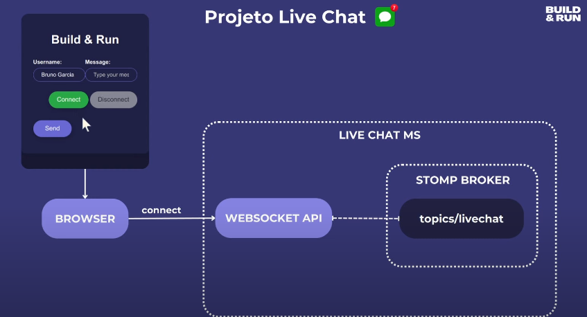

# About

A live chat project using Java, Spring Boot, Websockets, STOMP and AWS.

# What we'll do

- Learn the project structure
- Learn the difference between HTTP vs STOMP
- Understand more about STOMP protocol
- Build a project with Spring Boot, WebSocket and STOMP
- Deploy the project on AWS with ElasticBeanstalk

# Backend

- Spring Boot
- WebSocket
- STOMP

# Frontend

[Use this frontend](https://github.com/buildrun-tech/buildrun-livechat-spring-boot-websocket-stomp)

- HTML, CSS and JavaScript
- JQuery
- StompJS

# Project architecture and flow

## How does the HTTP protocol works?

- Unidirectional communication (request and response)
- Short connections
- Ideal to Rest APIs, file downloader, etc

So, HTTP is not the ideal type to real time communication (like a livechat).

## How does the STOMP protocol works?

Uses websocket as a transport layer

- Bidirectional communication (connect (started by the client), send, receive, disconnect).
  - The server can also send communication to the Client
- Persistent connection
- Ideal to real time communication

### Stomp

STOMP equals **Simple Text Oriented Messaging Protocol**.

He's kinda like HTTP but works in a different way. As we say in the topic above, when the websocket communicate with
STOMP we have a **bidirectional communication**.

The first connection is made, and inside this channel we have this **STOMP FRAME**.

#### Stomp Frame

Stomp frame can be sent **from the client to the server**, and vice versa. He has three fields:

1. Command
2. Headers
3. Body

#### Command

Basically, it would be the HTTP methods.

It can be:

- Connect
- Subscribe;
- Send
- Message
- Disconnect
- Others...

#### Headers

Kinda similar to HTTP as well (Key:Value), we have header1:value2 or header2:value2.

#### Body

When we have a send operation, for example we'll have the information: json for example.

### Stomp Frame example

# How the livechat is going to work with STOMP?

In the upper left, we have the interface of the project.

## First Step - Connection

The first step would type our username and click **CONNECT**. As soon as we do that, our browser will send a **Stomp Frame**,
making a connection with our Websocket API. This connection will be **bidirectional**. 

So after the "connect", we'll have this bidirectional channel with server (browser can send information to the API, and
the API can send information to the browser). 

## Second Step - Subscribe

Since the connection has been set up, not we are going to make a **SECOND STOMP FRAME**, subscribe!

Our application wants to receive all the messages from this livechat, so we need to "subscribe" inside this livechat.

The browser is going to send a Stomp Frame (subscribe type) to our WebSocket API and by that, everything will be configured.

**Basically: after our stomp frame subscribe is sent to the API, she'll know that everytime that a message comes up, it'll be
sended to the browser**.

## Third Step - Sending message

Alright, now we can type the message and send it. **But what will happen in the backend?**

Our browser will send a Stomp Frame (**SEND**) to topic "/livechat" and the message will arrive in the Websocket API.

We know that stomp is a message protocol, correct? In this example, we are using a **memory message protocol**.

That means that INSIDE OUR APPLICATION, we have a **STOMP BROKER**.

### Stomp Broker

We have can a lot of registered topics inside of it (topics/livechat).

We'll have all the messages that we received, with all the information of these messages.

You could use an external broker (like RabbitMQ or achieveMQ).

## Fourth Step - Message goes to the browser

Now that the message is allocated in the Stomp Broker memory, the WebSocket API understands that he has to send the message
(from the broker) to inside the browser.

After that, the message will be rendered.

## Summary

Stopped at: 13:16

# Tasks

## Developing

### Websocket configuration

### Creating the communication channel to receive new messages

### Preparing the message and sending the topic to Live Chat

### Importing frontend files (html, css & js) to our backend project

### Testing the project locally

### Understanding the details in the javascript code (STOMP.SJS)

## AWS Deploy

### AWS Elastic Beanstalk configuration

### Generating JAR

### AWS deploy

### Testing the project on other devices